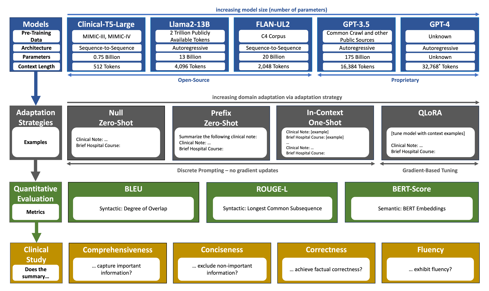

# Hospital Course Summarization with Adapted LLMs | JAMIA 2024

- <b> Title: </b>[A Dataset and Benchmark for Hospital Course Summarization with Adapted Large Language Models](https://arxiv.org/pdf/2403.05720)<br>
- <b>Authors: </b>[Asad Aali](https://asadaali.com/), Dave Van Veen, Yamin Ishraq Arefeen, Jason Hom, Christian Bluethgen, Eduardo Pontes Reis, Sergios Gatidis, Namuun Clifford, Joseph Daws, Arash S Tehrani, Jangwon Kim, Akshay S Chaudhari<br>
- <b>Insitute: </b>Stanford University<br>
- <b>Contact: </b>asadaali@stanford.edu<br>



## Environment
Use these commands to set up a conda environment:
```
conda env create -f env/environment.yml
conda activate bhc_summ
pip install -r env/requirements.txt
```

## Fine-Tuning
Set `model` and `case_id` as desired:
- `training/llama2_peft.ipynb`: fine-tune llama2 using QLoRA.
- `training/train_peft.sh`: fine-tune clin-t5, flan-t5, flan-ul2, falcon models using QLoRA.

## Inference
Set `model` and `case_id` as desired:
- `inference/gpt_inference.ipynb`: generate output from gpt models using discrete or in-context prompting.
- `inference/llama2_inference.ipynb`: generate output from fine-tuned llama models.
- `inference/run_discrete.sh`: generate output from other models via discrete prompting.
- `inference/run_peft.sh`: generate output from other fine-tuned models.
- `inference/calc_metrics.sh`: calculate metrics on outputs.

## Data
Download the pre-processed MIMIC-IV-BHC dataset, published on [PhysioNet](https://doi.org/10.13026/fh2q-4148).
- `utils/mimic_iv_bhc_preprocessing.py`: Script for generating the MIMIC-IV-BHC dataset. 

## Usage
1. In `src/constants.py`, set your own project directory `DIR_PROJECT`.
2. To modify default parameters, create a new `cases` entry in `src/constants.py`.
3. To add your own dataset, follow the format in `data/`, which contains a subset of chest x-ray reports from [Open-i](https://openi.nlm.nih.gov/faq).

## Citation
```
@article{aali2024benchmark,
  title={A Dataset and Benchmark for Hospital Course Summarization with Adapted Large Language Models},
  author={Aali, Asad and Van Veen, Dave and Arefeen, Yamin Ishraq and Hom, Jason and Bluethgen, Christian and Reis, Eduardo Pontes and Gatidis, Sergios and Clifford, Namuun and Daws, Joseph and Tehrani, Arash S and Chaudhari, Akshay S.},
  journal={Journal of the American Medical Informatics Association},
  year={2024},
  publisher={Oxford University Press}
}

@dataset{aali2024mimic,
  title={MIMIC-IV-Ext-BHC: Labeled Clinical Notes Dataset for Hospital Course Summarization},
  author={Aali, Asad and Van Veen, Dave and Arefeen, Yamin Ishraq and Hom, Jason and Bluethgen, Christian and Reis, Eduardo Pontes and Gatidis, Sergios and Clifford, Namuun and Daws, Joseph and Tehrani, Arash S and Chaudhari, Akshay S.},
  year={2024},
  publisher={PhysioNet}
}
```
